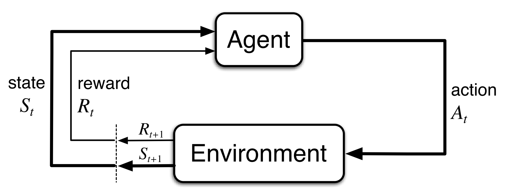
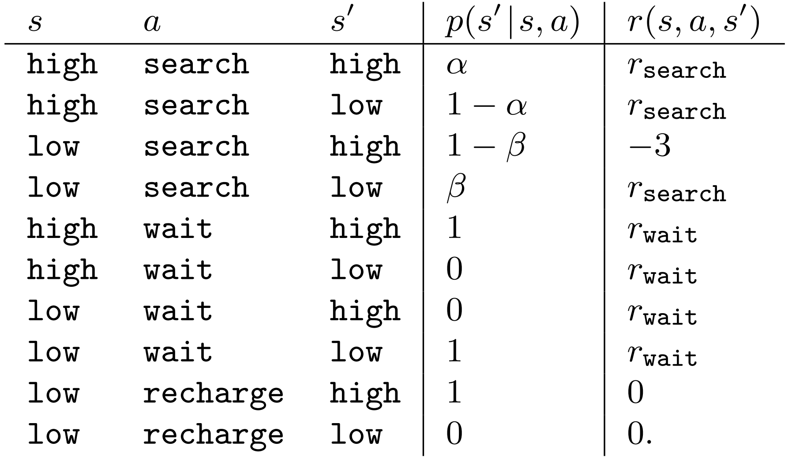
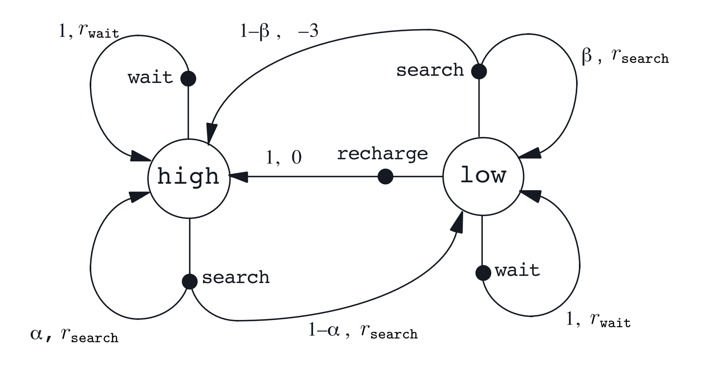
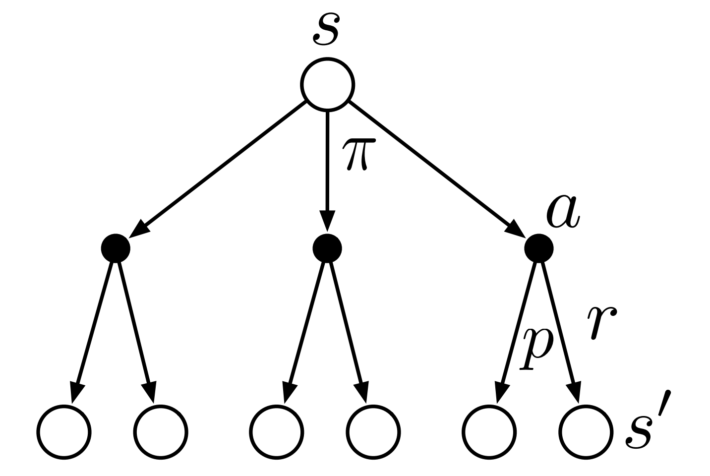
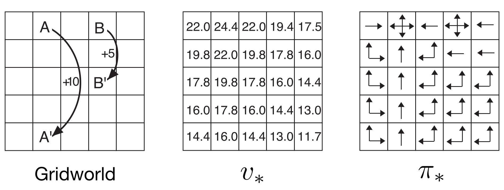

# 强化学习导论（三）- 有限马尔可夫决策过程

这章主要讲有限马尔可夫决策过程（finite MDPs）。

首先会涉及到上一章提到的评估反馈，但与之前不同的是，现在也会开始考虑问题与环境的联系，也就是在不同情景下去做不同的选择。MDPs 是决策序列的一种经典形式化模型，其中的行动不仅会影响当前的即时奖励值，也会通过未来的奖励值来影响后续的情况或状态。

## 3.1 The Agent–Environment Interface

- **agent**: 学习者/决策者
- **environment**: agent 与外界进行交互的物体的组合

Agent 和 environment 在一系列的时间点上进行交互：当时间为 $t(t = 0, 1, 2, 3, \ldots)$，agent 接收到环境的状态表示：$S_t \in \mathcal{S}$ ，在此基础上选择了一个行动 $A_t \in \mathcal{A}(s)$ ，之后 agent 会得到作为行动反馈的数值奖励 $R_{t+1}\in\mathcal{R}\subset\mathbb{R}$，并进入新状态 $S_{t+1}$。下图描绘了这样一个往复交替的过程。

关于如何划清 agent 和 environment 的界限，有一个通用的准则：**不能被 agent 任意改变的事物，均认为其属于 environment**。Agent 往往能够得知很多外界的信息，甚至能知道奖励值关于其行动和状态的具体函数，但我们还是得把奖励值的计算过程放在 agent 外界，而不能让他自己进行计算，这是因为，正是这个奖励机制定义了 agent 所要学习去处理的任务，所以这个任务必须是超出 agent 控制能力的，反之则本末倒置了，如果 agent 能自我计算/改变 reward ，那他会按照自己的一些「理解」去学习问题，而没有面对问题的「客观本质」去学习。

所以，agent 与 environment 的界限，代表着 **学习者/决策体 的绝对控制权，而不是其掌握的 知识/信息**。而一旦确定好三个关键因素「**状态**、**行动** 和 **奖励**」，就意味着这个界限已被确定下来。

任何**对受目标引导的行为**的学习问题，都可以简化为三个**信号**在 agent 和 environment 间前后传递的模型：

- **actions**: agent 的决策行动
- **states**: 进行行动选择的基准
- **rewards**: agent 的目标

### Example: Recycling Robot

前面的讲述可能有些抽象，这里举个实际的例子（清洁机器人）来看看 actions、states、rewards 在具体问题中是什么。这个机器人的主要目标是要持续清洁垃圾，但还需注意电量不被用完，所以在一些情况下得注意要回去充电，这就是问题背景，后面还会反复提到这个例子。

**Actions**:

- 活动起来去搜寻垃圾（耗电）
- 保持在原地等人来捡垃圾（不耗电）
- 回去充电

**States**:

- 电池状态

**Rewards**:

- 如果清洁了垃圾，反馈一个正值作为奖励
- 如果耗尽电量而没能及时返回充电，反馈一个较大负值作为惩罚
- 其余情况反馈 0 奖励值

这只是简单举个例子，用来给大家看看实际情况下是如何去通过这三个信号来定义一个问题。

## 3.2 Goals and Rewards

在强化学习中，agent 的目标通过 environment 传入的奖励信号来量化，具体而言，目标即为**最大化奖励值的累积求和**。换一种说法，不同的奖励值决定了不同的目标、不同的学习问题。

这里举个简单的例子作为对比：

- 让机器人学会走路：提供与行走距离成正比的奖励值作为机器人的奖励值。
- 让机器人学会逃出迷宫：逃出迷宫前的每一步都提供 -1 作为「奖励值」。

不难理解，如果提供正值作为奖励，则会不断「鼓励」机器人多走路，反之，则会「促使」机器人找到一条最短路径逃出迷宫。

前面说到，agent 的目标很清晰，就是最大化累积奖励值，而他的行动也很大程度受到我们给定的 rewards 的影响，不恰当地设定 rewards 必然会影响到 agent 的学习效果。所以，需要强调一点，我们要提供的 rewards ，是要用于**促使** agent 来**达成目标**，而不是根据人的先验知识来**告诉他该怎样去做**。说直白点，就是不要去人为「干预」他怎样学，只管给他设定目标和一些基本规则，让他多去自由探索。

举个例子，在下棋时，应该在真正赢下比赛时才给予适当奖励，而不是在吃掉对手某个棋子，亦或占据某个区域时就立即给他奖励。虽然按人的理解，吃掉棋子之类的行动一般都看似是个不错的选择，但在一些关键的步骤，说不定以退为进才是上策，盲目吃子反而陷入陷阱。所以如果按后者那样的策略去学习，agent 最终总会倾向于不顾输赢地去拿下这些眼前利益，而不去长远考虑，失去「大局观」。

之前强调过，rewards 的计算要放在 agent 外界，现在不难明白，原因就在于 agent 的终极目标是要去**掌握之前并不能完美掌握的事物**，而这正是我们设计强化学习来解决难题的本质。

## 3.3 Returns

目前已经明确了强化学习的目标——最大化累积奖励，那么如何用数学语言来表述呢？这里我们引入一个返回值（Return）的概念，定义为**奖励值序列的特定函数**。定义 $G_t$ 来表示时间点 t 之后的期望返回值，一种最简单的期望返回值为对未来的奖励值序列进行求和：

$$G_t\doteq R_{t+1}+R_{t+2}+R_{t+3}+\cdots+R_T$$

### Episodic Tasks

上述的返回值表示形式只在有限时间点条件（或者说有终止时间点）下适用，我们将这类任务定义为**片段式任务**：

- episodes: 决策体与环境的交互过程的子片段（任意重复性的交互过程），称为 episodes
- terminal state: 每个子片段都有一个特殊状态，其后续时间点被重置进入新片段，这样的特殊片段，称为 terminal state

在片段式任务中时常需要区分终止态，所以符号上也要有所区分：

- $\mathcal{S}$: 非终止态的全体集合
- $\mathcal{S}^+$: $\mathcal{S} \bigcup$ {终止态全体}

### Continuing Tasks

在很多时候，agent 与 environment 的交互过程并不能很自然地被分解为「片段」，而是无止限地持续下去，称之为连续式任务。此时上面的 $G_t$ 会因 $T=\infty$ 而必然趋于无穷，导致 agent 无法根据返回值来进行比较学习，此时需要加入「削减系数」$\gamma$ 。

**削减返回值**:

$$G_t\doteq R_{t+1}+\gamma R_{t+2}+\gamma^2 R_{t+3}+\cdots = \sum_{k=0}^{\infty}\gamma^kR_{t+k+1}$$

其中 $\gamma(0\leq \gamma \leq 1)$ 作为削减率，决定了未来奖励值在当前的表现：

- 若 $\gamma \rightarrow 0$，agent 更着重于最大化即时奖励值，也就是说，此时他的目标为学习如何选择 $A_t$ 来最大化 $R_{t+1}$.
- 若 $\gamma \rightarrow 1$，返回值会更加强烈地把未来的奖励情况考虑进来，使得 agent 变得更有「远见」。

## 3.4 Unified Notation for Episodic and Continuing Tasks

在后面的讨论中，我们会对各种任务来统一地来讨论分析，所以需要统一符号。

在片段式任务中，我们应该用 $S_{t,i}$ 来表示第 i 段的第 t 步（ $A_{t,i}, R_{t,i}, \pi_{t,i}, T_i$ 等同理），但是每一段其实本质上意义相近，对于其他段我们可以统一分析，故简写 $S_t$ 来统一表示各个 $S_{t,i}$，其他几个符号也同理。

此外，我们还需要统一片段式任务和连续式任务的形式，他们分布有着有限项的返回值公式和无限项的返回值公式，为了统一公式，我们针对片段式任务加入一种特殊的「吸收态」，其特点是状态的交互和转移过程都只在自身进行，且奖励值为 0 ，如下图所示：

这样显然可见，片段式任务也能表示为无穷项了，只不过原本的终止态之后 reward 为 0，不对公式造成影响。于是我们可以统一地定义：

$$G_t\doteq \sum_{k=t+1}^{T}\gamma^{k-t-1}R_k$$

## 3.5 The Markov Property

回想我们进行强化学习的主要目标在于，学习出一个能由任意状态信号决定行动的策略函数，而状态是以**即时感知以及历史状态和信息**为基础，逐渐**构筑、维护**下来的，他包含一定的历史信息，但并不意味着能从中得知环境中的一切信息。比如棋盘上的棋子，棋子在不同的位置即在不同的状态，从每个状态，我们能知道走下这步棋各种可能的组合，但并不能准确得知他是如何一步一步走到这一步的。

正如上面的棋子的例子一样，我们称，如果一个状态继承并保留了所有相关信息，则具有**马尔可夫性质**。下面在用数学语言描述一下这一性质。

### Markov Property

首先定义基于全部历史信息的完全联合分布：

$$\mathrm{Pr}\{S_{t+1}=s',R_{t+1}=r|S_0,A_0,R_1,\ldots,S_{t-1},A_{t-1},R_t,S_t,A_t\}$$

环境的动态分布定义为：

$$p(s',r|,s,a)\doteq \mathrm{Pr}\{S_{t+1}=s',R_{t+1}=r|S_t=s,A_t=a\}$$

当且仅当上面两式相等，即

$$p(s',r|s,a) = \mathrm{Pr}\{S_{t+1}=s',R_{t+1}=r|S_0,A_0,R_1,\ldots,S_t,A_t\}$$

我们称这样的环境和任务具有**马尔可夫性质**。

马尔科夫性质在强化学习中的重要之处体现在，如果问题具备这一条件，那么各种决策值将只与当前状态有关，这能极大程度地方便我们分析各种理论和模型。即使是非严格遵守马尔可夫性质的问题，也能有所应用。

_这本书之后的所有理论都将基于马尔可夫性质来讨论。_

## 3.6 Markov Decision Processes

如果一个强化学习任务满足马尔可夫性质，我们称之为**马尔可夫决策过程（MDP）**。如果状态空间和行动空间都是有限的，则称为**有限马尔可夫过程（finite MDP）**。

在有限马尔可夫过程中，状态集、行动集、奖励集（$\mathcal{S}, \mathcal{A}, \mathcal{R}$）内的元素均有上届，所以能定义

$$p(s',r|s,a)\doteq\mathrm{Pr}\left\{S_t=s',R_t=r|S_{t-1}=s,A_{t-1}=a\right\}$$

其中

$$\sum_{s'\in\mathcal{S}}\sum_{r\in\mathcal{R}}p(s',r|s,a)=1$$

有了 $p(s',r|s,a)$ ，我们可以进一步计算得到：

- **状态转移概率**:

$$p(s'|s,a)\doteq\mathrm{Pr}\left\{S_t=s'|S_{t-1}=s,A_{t-1}=a\right\}=\sum_{r\in\mathcal{R}}p(s',r|s,a)$$

- **给定状态、行动的期望奖励**:

$$r(s,a)\doteq \mathbb{E}\left[R_t|S_{t-1}=s,A_{t-1}=a\right]=\sum_{r\in\mathcal{R}}r\sum_{s'\in\mathcal{S}}p(s',r|s,a)$$

- **给定状态、行动、后继状态的期望奖励**:

$$r(s,a,s')\doteq \mathbb{E}\left[R_t|S_{t-1}=s,A_{t-1}=a,S_t=s'\right]=\sum_{r\in\mathcal{R}}r\frac{p(s',r|s,a)}{p(s'|s,a)}$$

得到这些动态性质后，有助于我们后面的具体分析。

### Example: Recycling Robot MDP

前面提到的清洁机器人，便能按照有限马尔科夫决策过程来分析。下面的图表详细地描述了怎样用 MDP 来分析问题。比如第三、四行，表示机器人在低电量下仍去搜索垃圾，有 $\beta$ 的概率仍然是低电量，收获 $r_{search}$ 的奖励值，有 $\beta​$ 的概率耗尽电量未能及时自行返回充电，被人工带回充电后进入高电量状态，同时给予 -3 的惩罚值。其他的过程也可类似分析，可以看出在分析接下来情景时，我们无需考虑机器人过去所有做过的事情，只需要从当前状态出发，分析进入下一个可能状态的过程即可。

## 3.7 Value Functions

强化学习算法总是涉及到估计 value function，用于量化评估不同条件下行动的好坏程度。这里我们可以对返回值求期望来作为 value function 来进行评估，而显然 agent 的策略决定了如何来计算这一期望。

回想我们反复说到的策略这一概念，简单来说，策略是由状态空间 $\mathcal{S}$、行动空间 $\mathcal{A}$ 到概率空间的一个映射：$\pi:\mathcal{S}\times\mathcal{A}\to \mathcal{P}$ 。

- $\pi(a|s)$: 状态为 s 时选择行动 a 的概率
- $v_{\pi}(s)$: **策略 $\pi$ 下的状态值函数**。表示状态 s 下，遵守策略 $\pi$ 的期望返回值。对于 MDP，我们可以定义

$$v_{\pi}(s)\doteq\mathbb{E}_{\pi}\left[G_t|S_t=s\right]=\mathbb{E}_{\pi}\left[\sum_{k=0}^{\infty}\gamma^kR_{t+k+1}\mid S_t=s\right], \forall s \in \mathcal{S}$$

- $q_{\pi}(s,a)$: **策略 $\pi$ 下的行动值函数**。表示状态 s 下，选择行动 a ，遵守策略 $\pi$ 的期望返回值。类似地，可以定义

$$q_{\pi}(s,a)\doteq\mathbb{E}_{\pi}\left[G_t|S_t=s,A_t=a\right]=\mathbb{E}_{\pi}\left[\sum_{k=0}^{\infty}\gamma^kR_{t+k+1}\mid S_t=s,A_t=a\right]$$

### **Monte Carlo Methods**

上面的函数可以通过模拟方法来进行经验估计，称为蒙特卡洛方法。

- 在实验中，若 agent 在遵守策略 $\pi$ 的条件下，为每个出发状态 s 都保留了后面的真实返回值的均值，显然这个均值会随实验次数增加而最终收敛到 $v_{\pi}(s)$.
- 类似地，如果还细分到为每个出发状态 s、每个行动选择 a 都保留了真实返回值的均值，则便能最终收敛到 $q_{\pi}(s,a)$.

如果状态空间很大，显然可知，进行上述的大量样本实验来模拟估计很不现实。此时可以考虑将 $v_{\pi}, q_{\pi}$ 看作参数化函数，通过调参来逼近真实值，一样能够较为精确地进行估计（第五章讲）。

### Bellman Equation

Value function 被用在强化学习和动态规划的一个基本性质在于其满足一种特殊递归关系：

$$\begin{aligned} v_\pi(s) &\doteq \mathbb{E}_\pi[G_t\,|\,S_t=s] \\ &=\mathbb{E}\pi \left[\sum_{k=0}^\infty\gamma^kR_{t+k+1}\,|\,S_t=s \right] \\ &= \mathbb{E}_\pi \left [R_{t+1}+\gamma\sum_{k=0}^\infty\gamma^kR_{t+k+2}\,|\,S_t=s \right] \\ &=\sum_a\pi(a|s)\sum_{s'}\sum_rp(s',r|s,a)\left[r+\gamma \mathbb{E}_\pi \left[\sum_{k=0}^\infty\gamma^kR_{t+k+2}\,|\,S_{t+1}=s' \right] \right] \\ &= \sum_a\pi(a|s)\sum_{s',r}p(s',r|s,a)\left[r+\gamma v_\pi(s') \right], \qquad \forall s \in \mathcal S \end{aligned}$$

- $a$: 一个行动，取自行动集 $\mathcal{A}(s)$
- $s'$: 后继状态，取自状态集 $\mathcal{S}$ （对于片段式任务，取自 $\mathcal{S}^+$ ）
- $r$: 奖励值，取自奖励集 $\mathcal{R}$

对于任意策略 $\pi$ 和状态 s ，当前 value 和未来可能的 value 满足上面的递推关系，称为**贝尔曼方程（Bellman Equation）**。

**$v_\pi$ 的贝尔曼方程：**

> $$v_{\pi}(s) = \sum_a\pi(a|s)\sum_{s',r}p(s',r|s,a)\left[r+\gamma v_\pi(s') \right]$$

贝尔曼方程描述了**状态值与所有后继状态值的关系**。

如上面这样的示意图，我们称为「**backup diagrams**」，它能描绘出问题的更新反馈机制，这也正是强化学习算法的一个核心之处。

### Example: Gridworld

在这个例子中，每一格上有四个等概率行动（往四个方向移动）。若从靠边的格子往界外移动，则会给予 -1 的惩罚，但位置保持不变，若移入特殊点 $A,B$ ，则分别被移入 $A',B'$ 并给予 +10、+5 的特殊奖励，其余情况的奖励为 0 。

右图则是通过解贝尔曼线性方程组求出了 $v_{\pi}$ 的解并填写在格子上（每个格子分别对应一个状态 $s_i$，填写的值则为 $v_{\pi}(s_i)$ ）。本例中，$\gamma = 0.9$。

## 3.8 Optimal Value Functions

解决强化学习问题就是在于找到一个最优的测量，使 agent 能够按照该策略行动并得到最好的累积奖励值，在 MDP 中，当且仅当一个策略 $\pi​$ 在任意状态下的期望返回值都大于等于策略 $\pi'​$ 的期望返回值，称策略 $\pi​$ 优于策略 $\pi'​$ ，即： $\pi \geq \pi'​$ 当且仅当 $v_{\pi}(s)\geq v_{\pi'}(s), \forall s \in \mathcal{S}​$.

- **最优策略**：至少存在一个策略，优于其他所有策略，称所有这样的策略为最优策略
- **最优状态值函数**：$v_*(s)\doteq \max\limits_{\pi}v_{\pi}(s),\forall s \in \mathcal{S}$
- **最优行动值函数**：$q_*(s,a)=\max\limits_{\pi}q_{\pi}(s,a),\forall s \in \mathcal{S}$

其中易知，$q_*(s,a)=\mathbb{E}\left[R_{t+1}+\gamma v_*(S_{t+1})\mid S_t=s,A_t=a\right]$

### Bellman Optimality Equation

$v_*$ 作为 value function，也有贝尔曼方程，此时称该方程为贝尔曼最优方程。

贝尔曼最优方程表述了**最优策略下一个状态的状态值，必然等于该状态下最优行动的期望返回值**：

$$\begin{aligned}v_*(s) &= \max_{a\in \mathcal A(s)}q_{\pi_*}(s,a) \\ &=\max_a \mathbb{E}_{\pi_*} \left[G_t \mid S_t=s, A_t=a \right] \\ &= \max_a \mathbb{E}_{\pi_*} \left[\sum_{k=0}^\infty \gamma^kR_{t+k+1} \mid S_t=s,A_t=a \right] \\ &= \max_a \mathbb{E}_{\pi_*} \left[R_{t+1}+\gamma \sum_{k=0}^\infty\gamma^kR_{t+k+2}\mid S_t=s,A_t=a \right] \\ &= \max_a \mathbb{E}[R_{t+1}+\gamma v_*(S_{t+1}) \mid S_t=s,A_t=a] \\ &=\max_{a}\sum_{s',r}p(s',r \mid s,a)[r+\gamma v_*(s')]\end{aligned}$$

**贝尔曼最优方程**:

- $v_*$:

> $$\begin{aligned} v_*(s)&= \max_a \mathbb{E}[R_{t+1}+\gamma v_*(S_{t+1}) \mid S_t=s,A_t=a]\\&=\max_{a}\sum_{s',r}p(s',r \mid s,a)[r+\gamma v_*(s')]\end{aligned}$$

- $q_*$:

> $$\begin{aligned}q_*(s,a) &= \mathbb{E} \left[R_{t+1}+\gamma \max_{a'}q_*(S_{t+1},a') \mid S_t=s,A_t=a \right] \\ &= \sum_{s',r}p(s',r \mid s,a)\left[r+\gamma \max_{a'}q_*(s',a') \right]\end{aligned}$$

在上面的 backup diagrams 中，我们用一个圆弧来表示在不同的选项中去最大值。

对于有限 MDP ，贝尔曼最优方程一定有独立于策略的唯一解。事实上，设有 n 个状态，每个状态对应一个方程，这样总共由 n 个不同的方程形成 n 元方程组，如果环境的动态 $p(s',r|s,a)$ 给定，由数学知识可知，该方程组必然能得到唯一解 $v_*$ ，进而又可利用其计算得到 $q_*$ 。

一旦求得这一解，便能确定最优策略：

>  **最优策略**：显然至少存在一个行动能使行动值取到 $v_*$ ，如果一个策略只将非 0 概率分配给这样的行动，称这个策略是最优策略。

如果每一步都采取**贪心策略**，即只根据 $v_*$ 来确定下一步的行动，这样的行动却恰好是最优行动，$v_*$ 的优美之处便体现于此。之所以能达到这一效果，是因为 $v_*$ 已经考虑到了未来所有可能性，于是，看似贪心的「一步搜索」却能生成出全局最优行动。

如果我们进一步解得了 $q_*$ ，agent 甚至都无需来做「一步搜索」：对于任意状态 s ，只需找到 $a_0$ 使得 $q_*(s,a_0)=\max\limits_{a}q_*(s,a)$ 即可。这是因为我们已经在之前的工作中多做了一些准备，将进一步的搜索信息缓存在了各个 $q_*$ 中，使得它的信息量比 $v_*$ 更大。

### Example: Solving the Gridworld

- 中图：最优状态值函数
- 右图：最优策略

显式求解贝尔曼最优方程虽然能直接确定最优策略，但是并不太实用，因为这一方法涉及到了「穷举」，依赖严苛的计算资源和内存条件。此外，这个方法还依赖于三个假设，使得问题本身就很难利用上这一方法：

1. 精确地知道环境的动态性质 $p$
2. 有足够的计算资源
3. 满足马尔可夫性质

在后面的章节中会介绍一些算法，如「启发式搜索」、「动态规划」等，可以看作是对「解贝尔曼方程」的近似求解，能够弥补上述的一些不足之处。

## 3.9 Optimality and Approximation

前面已经讲过，最优策略是通过耗费极端的计算资源求得的，这使得我们不得不考虑一些方法来近似估计前面的一些函数。

在近似求解最优行为时，我们不难想象，会有很多状态其实只会以极低概率出现，我们若仍对其求解最优行动则意义不大，这时候如果选取一个局部最优行动来代替最优行动，显然，从整体期望意义来看，对总体奖励值造成的影响其实并不大，但却能节省很多的计算资源。与之对应的，当遇到那些经常出现的状态，我们则务必求出最优解。这是在解决 MDP 时强化学习方法区别于其他近似方法的一个重要性质。