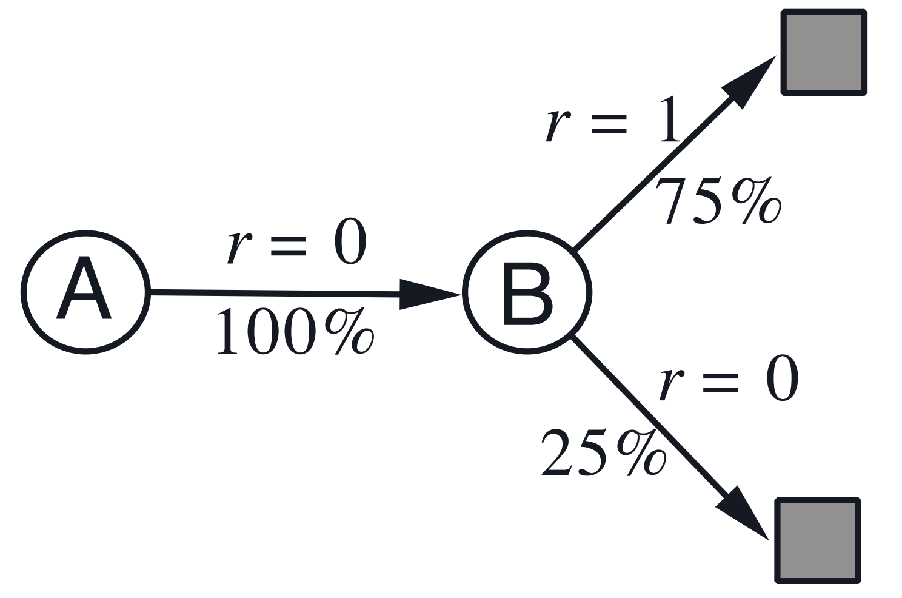
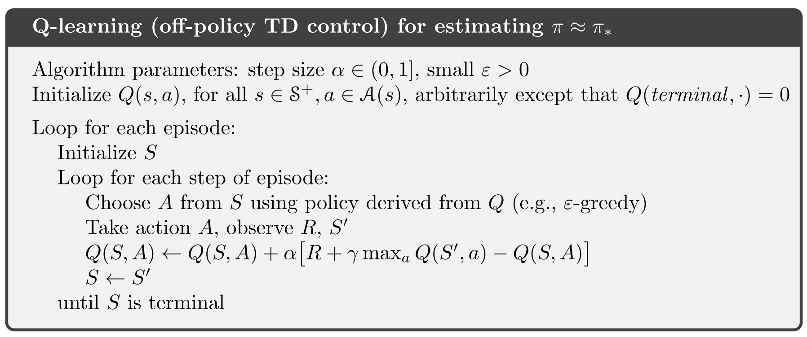
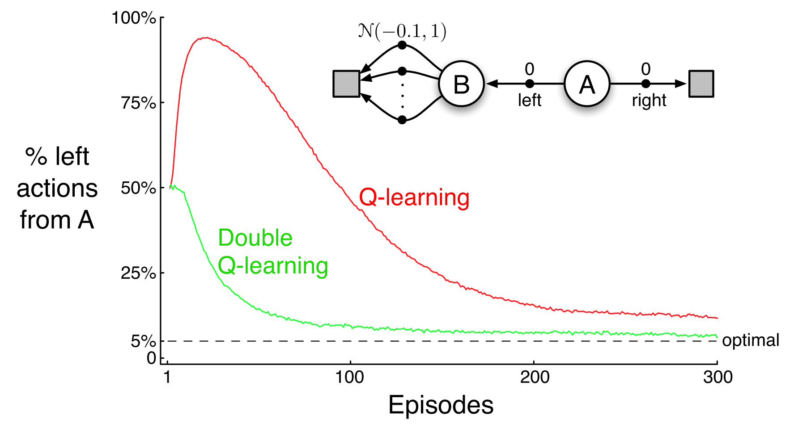
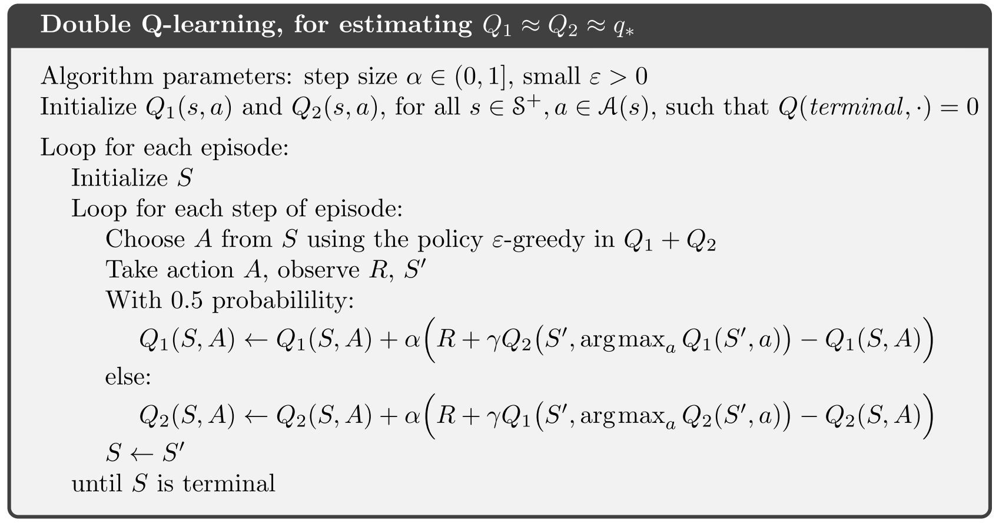

# 强化学习导论（六）- 时序差分学习

本章在上一章的基础上，进一步介绍了新的方法：**时序差分学习**（Temporal-Difference learning），简称 TD Learning。

时序差分学习可以看作蒙特卡罗（MC）和动态规划（DP）的一种结合：

- 和 MC 的相似之处在于，TD 方法从实际的经验来获取信息，无需获知环境的全部信息。
- 和 DP 的相似之处在于，TD 方法能够利用上之前已知的信息来做实时学习，无需等得到完整的收益反馈再进行估值更新。

本章同样基于 **GPI 模型**，来介绍基于时序差分学习（TD learning）的算法。

## 6.1 TD Prediction

我们先对比看看上一章的 MC 算法（固定$\alpha$）和本章的 TD 算法的核心公式：

**constant-$\alpha$ MC:**

$$
V(S_t)\leftarrow V(S_t)+\alpha\left[G_t-V(S_t)\right]
$$

**TD(0) (one-step TD):**

$$
V(S_t)\leftarrow V(S_t)+\alpha\left[R_{t+1}+\gamma V(S_{t+1})-V(S_t)\right]
$$

- MC 方法必须等待整个 episode 结束后得到 $G_t$ 才能做一次更新。
- TD 方法则只需等到这一步结束，利用实时观测到的奖励值 $R_{t+1}$ 和现有估计值 $V(S_{t+1})$ 来进行更新。

*这里的 TD(0) 方法指**单步 TD 方法**，括号里的 0 改为其他数字后又指其他算法，将会在后面章节介绍。*

我们在第二章讲过，这样的更新式可以更广义地写作

$$
NewEstimate\leftarrow OldEstimate+StepSize\left[Target-OldEstimate\right]
$$

将括号中的式子看作是一种误差，便可将这样的更新式看作是不断地在消除误差。我们将 TD 方法中的这个误差定义为 **TD error:**

$$
\delta_t\doteq R_{t+1}+\gamma V(S_{t+1})-V(S_t)
$$

## 6.2 Advantages of TD Prediction Methods

### 优点

- 无须获知环境的具体模型。
- 通过一种在线的、完全实时的方式来进行增量更新。
- 如果 episodes 太长，或者是连续型任务，MC 方法将会有很严重的延迟问题，TD 方法能够解决这种问题。

### 收敛性

给定策略 $\pi$ ，满足一定条件的情况下，能够证明 TD(0) 方法能确保 $v$ 收敛到 $v_\pi$：

$$
\sum_{k=1}^{\infty}\alpha=\infty\qquad \mathrm{and}\qquad\sum_{k=1}^{\infty}\alpha^2<\infty
$$

这个结果是来自随机逼近方面的理论，我们在第二章也提到过。需要注意的是，这只是其收敛的一个必要条件，一些情况下即使不满足，也一样能收敛。

### 效率对比

- 目前还没能从数学上证明哪个方法（TD & MC）收敛得更快。
- 实际情况下，对于随机性的任务，TD 方法通常收敛得比 constant-$\alpha$ MC 方法要快一些。

**一个例子**:

问题的背景就是从中间结点 C 出发，若能达到右边的终止态，返回奖励值 1，其余情况均返回奖励值 0。我们用 $P_i$ 来表示当我们处于状态 i 下，最终能到达右终止态的概率，易知

$$
\begin{cases}
P_a=\dfrac{1}{2}P_b+\dfrac{1}{2}\times 0\\
P_b=\dfrac{1}{2}P_a+\dfrac{1}{2}P_c\\
P_c=\dfrac{1}{2}P_b+\dfrac{1}{2}P_d\\
P_d=\dfrac{1}{2}P_c+\dfrac{1}{2}P_e\\
P_e=\dfrac{1}{2}P_d+\dfrac{1}{2}\times 1\\
\end{cases}
$$

解上述方程，可得

$$
P_a=\frac{1}{6},P_b=\frac{2}{6},P_c=\frac{3}{6},P_d=\frac{4}{6},P_e=\frac{5}{6}
$$

由于到达右终止态的 reward 是 1，那么乘上这个奖励值，最终的期望值其实就等于这些概率

$$
V(A)=\frac{1}{6},V(B)=\frac{2}{6},V(C)=\frac{3}{6},V(D)=\frac{4}{6},V(E)=\frac{5}{6}
$$

那么，在这个问题背景下，我们的算法表现如何呢？

- 左图描绘了 TD(0) 算法下经过 n 个 episodes 后得到的估计值，可以看出，100 次训练后，估计值已经非常接近真实值了。
- 右图对比了两种算法在不同 $\alpha$ 取值下的误差收敛曲线。可以看出，至少在该例中，TD 方法确实要优于 MC 方法。

## 6.3 Optimality of TD(0)

### 批量更新（Batch Update）

$$
V(S_t)\leftarrow V(S_t)+\alpha\left[G_t-V(S_t)\right]\\
V(S_t)\leftarrow V(S_t)+\alpha\left[R_{t+1}+\gamma V(S_{t+1})-V(S_t)\right]
$$

对于上面这样的更新式，我们可以通过**批量更新（Batch Update）**来进行更新操作：

- 每一步 t 我们仍按照原来的步骤做计算，求出增量（也就误差值）。
- 先不执行更新，而是将增量（误差值）累积起来。
- 当一整批训练数据都按上述步骤处理完后，再统一将增量更新到目标值上。

### Certainty-Equivalence Estimate

#### 例子

给定 8 个 episodes 作为一个 batch：

$$
\begin{aligned}
(A,0,B,0)\qquad&(B,1)&(B,1)\qquad&(B,1)\\
(B,1)\qquad&(B,1)&(B,1)\qquad&(B,0)
\end{aligned}
$$

很显然，可以看出 $V(B)=\frac{3}{4}$ ，而 $V(A)$ 则有两种答案，在 TD 方法下 $V(A)=\frac{3}{4}$ ，而对于 MC ，$V(A)=0$ 。为什么会发生这样的情况呢？我们先来按照两种方法模拟计算一下：

#### TD(0) methods

$$
V_0(A)=V_0(B)=V(T)=0\\
\alpha_a=1,\alpha_b=\frac{1}{8},\gamma=1\\
\begin{aligned}
(1)&{\begin{cases}
\delta_1(A)=R_0+V_0(B)-V_0(A)=0+0-0=0\\
\delta_1(B)=\sum_{i}\left[R_{0i}+V(T)-V_0(B)\right]=6+0-0=6\\
V_1(A)=V_0(A)+1\times\delta_1(A)=0\\
V_1(B)=V_0(B)+\frac{1}{8}\delta_1(B)=\frac{3}{4}
\end{cases}}\\
(2)&{\begin{cases}
\delta_2(A)=R_1+V_1(B)-V_1(A)=0+\frac{3}{4}-0=\frac{3}{4}\\
\delta_2(B)=\sum_{i}\left[R_{1i}+V(T)-V_1(B)\right]=6+0-\frac{8\times3}{4}=0\\
V_2(A)=V_1(A)+1\times\delta_2(A)=\frac{3}{4}\\
V_2(B)=V_1(B)+\frac{1}{8}\delta_2(B)=\frac{3}{4}
\end{cases}}\\
\vdots\\
(n)&{\begin{cases}
\delta_n(A)=0,\delta_n(B)=0\\
V_n(A)=\frac{3}{4},V_n(B)=\frac{3}{4}
\end{cases}}
\end{aligned}
$$

#### MC methods

$$
V_0(A)=V_0(B)=V(T)=0\\
\alpha_a=\alpha_b=\frac{1}{8},\gamma=1\\
\begin{aligned}
(1)&{\begin{cases}
\delta_1(A)=G_1(A)-V_0(A)=0-0=0\\
\delta_1(B)=\sum_{i}\left[G_{0i}-V_0(B)\right]=6-0=6\\
V_1(A)=V_0(A)+\frac{1}{8}\delta_1(A)=0\\
V_1(B)=V_0(B)+\frac{1}{8}\delta_1(B)=\frac{3}{4}
\end{cases}}\\
(2)&{\begin{cases}
\delta_2(A)=G_1(A)-V_1(A)=0-0=0\\
\delta_2(B)=\sum_{i}\left[G_{2i}-V_1(B)\right]=6-6=0\\
V_1(A)=V_0(A)+\frac{1}{8}\delta_1(A)=0\\
V_1(B)=V_0(B)+\frac{1}{8}\delta_1(B)=\frac{3}{4}
\end{cases}}\\
\vdots\\
(n)&{\begin{cases}
\delta_n(A)=0,\delta_n(B)=0\\
V_n(A)=0,V_n(B)=\frac{3}{4}
\end{cases}}
\end{aligned}
$$

#### 确定性等价估计

- MC 方法本质上是对**训练集**给出了**最小均方误差估计**，在我们这个例子中，A 出现了的 episode 只有一个，而恰好其最终返回值 $G(A)=0$ ，MC 方法基于这段经验就认为 $V(A)=0$ ，这就显得有点「过拟合」了——过于追求训练集上的最小误差，而没有充分考虑综合因素。
- TD(0) 方法则是给出了**极大似然估计**：$\hat{\theta}=\mathop{\arg\max}\limits_\theta p(\theta|\mathbf{x})$ 。此处的极大似然估计不是某个具体的参数，而是基于观测数据形成的马尔可夫过程**模型**。极大似然估计其实就是**给定数据的最大生成概率的对应估计**，也就是说，前面的这个模型包含了对状态转移概率、奖励值等信息的正确估计，一旦给定正确的信息，它就能作出合理的估计。我们称这样的估计为**确定性等价估计（Certainty-Equivalence Estimate）**。

而 TD 方法之所以通常比 MC 收敛得更快，正是因为它是确定性等价估计，更加稳健高效。

## 6.4 & 6.5 & 6.6 TD Control

这三节均是基于 GPI 介绍具体的 TD 算法，由于三种算法本质相近，故将三节合在一起说。

前面提到，我们要按照下面的形式来更新目标值

$$
Q(S_t,A_t)\leftarrow Q(S_t,A_t)+\alpha\left[R_{t+1}+\gamma\hat{Q}(S_{t+1},A_{t+1})-Q(S_t,A_t)\right]
$$

注意到更新式中我们把 $Q$ 写作 $\hat{Q}$ ，统一表示对 $Q$ 的估计，可以是原有的估计方式 $Q(S_{t+1},A_{t+1})$ ，也可以是其他的估计，在这三节里，不同的估计方法就分别对应了不同的算法，那为什么要这样做呢？

我们前面介绍的 TD 算法是在拿旧的 $Q_{old}$ 计算误差：

$$
R_{t+1}+\gamma Q_{old}(S_{t+1},A_{t+1})-Q_{old}(S_t,A_t)
$$

但我们本应用 $Q_{new}$ 来计算：

$$
R_{t+1}+\gamma Q_{new}(S_{t+1},A_{t+1})-Q_{old}(S_t,A_t)
$$

这种直接采用旧的估计值来更新 target 的方法，稍加分析能够发现其实就是统计学里的**自助抽样法（bootstrap)**——有放回地重新抽样。回到前面的问题，为什么要这样做？在我们重新抽样后，有人认为应按原有方式继续那样计算，也有人认为那样计算不能很好地代表 $Q_{new}$ ，所以，在不同的见解下，对这个估计值 $\hat{Q}$ 做不同的调整，形成了不同的算法。

### Sarsa 算法

若 $\hat{Q}(S_{t+1},A_{t+1})=Q(S_{t+1},A_{t+1})$ ，这时的 TD 算法称为 Sarsa ，其更新式为

$$
Q(S_t,A_t)\leftarrow Q(S_t,A_t)+\alpha\left[R_{t+1}+\gamma Q(S_{t+1},A_{t+1})-Q(S_t,A_t)\right]
$$

- 由于算法的每次更新需要用到数据组合 $(S_t,A_t,R_{t+1},S_{t+1},A_{t+1})$ ，故取其字母组成其名字 SARSA ，称为 Sarsa 算法。
- 显然，Sarsa 是 On-policy 的算法，且和 MC 相似，需要确保各状态都被访问足够多次数才能收敛，因此一般都用于 $\varepsilon$-greedy 或 $\varepsilon$-soft 策略。

### Q-learning 算法

若 $\hat{Q}(S_{t+1},A_{t+1})=\max\limits_aQ(S_{t+1},a)$ ，这时的 TD 算法称为 Q-learning ，其更新式为

$$
Q(S_t,A_t)\leftarrow Q(S_t,A_t)+\alpha\left[R_{t+1}+\gamma  \max\limits_aQ(S_{t+1},a)-Q(S_t,A_t)\right]
$$

易分析知，我们是从所有的 $Q(S_{t+1},a)$ 中直接**选取**了最大值来更新（而不是像前面的 Sarsa 一样还需往前实际走一步 $A_{t+1}$）就能完成更新， 更新之后，我们可以任意采取其他策略来做 exploration actions ，所以 Q-learning 是 Off-policy 方法。

### Expected Sarsa

若 $\hat{Q}(S_{t+1},A_{t+1})=\mathbb{E}_\pi\left[Q(S_{t+1},A_{t+1})\mid S_{t+1}\right]$ ，这时的 TD 算法称为 Expected Sarsa ，其更新式为

$$
\begin{aligned}
Q(S_t,A_t)&\leftarrow Q(S_t,A_t)+\alpha\left[R_{t+1}+\gamma  \mathbb{E}_\pi\left[Q(S_{t+1},A_{t+1})\mid S_{t+1}\right]-Q(S_t,A_t)\right]\\
&\leftarrow Q(S_t,A_t)+\alpha\left[R_{t+1}+\gamma\sum_a\pi(a|S_{t+1})Q(S_{t+1},a)  -Q(S_t,A_t)\right]
\end{aligned}
$$

Expected Sarsa 可以看作是对 Sarsa 的一种改进，它只会略微增加计算上的消耗，但能降低方差，更加稳定。

下面是一个具体的实验范例：

- **Asymptotic performance**: 图中的 Asymptotic performance 指 100,000 个 episodes 之后的实验结果均值。
- **Interim performance**: 图中的 Interim performance 指 100 个 episodes 之后的实验结果均值。

从图中可以看出，即使 $\alpha=1$ ，Expected Sarsa 也一样能够收敛（此时其形式很接近 DP ），而 Sarsa 则只能在 $\alpha$ 较小时才有好的表现。

Expected Sarsa 可以是 On-policy ，也可以是 Off-policy 。

## 6.7 Maximization Bias and Double Learning

前面提到的许多算法都含有**最大化**的操作，通过这些最大化操作来逐步构建出最优策略，比如 Q-learning 中有 $\max\limits_a Q(S_{t+1},a)$ 、Sarsa 中也常有 $\varepsilon$-greedy 策略，同样包含最大化操作。这些最大化操作常常会造成显著的正偏差。

我们考虑一个例子：

- 只有一个状态 s 。
- 许多行动 a 的真实值 $q(s,a)$ 为 0 ，而估计值 $Q(s,a)$ 在 0 附近波动，可正可负。
- 最大化操作下的估计值，很大概率会是正值，因此产生了正偏差。

我们称上面这类的正偏差为 **maximization bias** 。

显然我们是需要消除这样的偏差值，下面引入 Double Learning 来解决这一问题。

### Double Learning

首先看个例子

- 如上图右上角的示意图所示，每个 episode 均从状态 A 出发，能够选择的行动只有**向左**或者**向右**，对应的奖励值均为 0 。
- 由于 $R(B)\sim\mathcal N(-0.1,1)$ ，易分析知，最后会有 $V(left)=-0.1, V(right)=0$ ，所以理论上只应该选择向右而不是向左。

然而，在刚开始信息量不足时，向左的行动本应预期反馈 -0.1 左右的值，结果由于算法中的「最大化操作」，反而可能反馈了正的奖励值，导致此时模型更倾向于选择向左行动，如上图红线所示。从这个例子可以看出，正偏差带来的影响非常大，即使是很多次训练后，仍然有较大的误差偏离。因此，需要采用 Double Learning 来消除这一问题。

**Double Learning**:

- 将样本分划为两个集合，并分别学习出独立的估计，简记作 $Q_1(a), Q_2(a)$ ，两者均是对真实值 $q(a)$ 的估计。
- 用其中一个估计值来决定最优行动 $A^*=\mathop{\arg\max}\limits_aQ_1(a)$ 。
- 通过另一个估计值来计算最优行动对应的值函数 $Q_2(A^*)=Q_2(\mathop{\arg\max}\limits_aQ_1(a))$ 。$Q_2(A^*)$ 是无偏估计，这是因为 $\mathbb{E}[Q_2(A^*)]=q(A^*)$ 。
- 还可以重复一遍上述过程，并替换两个集合，得到另一个无偏估计 $Q_1(\mathop{\arg\max}\limits_aQ_2(a))$ 。

这便是 **double learning** 的思想，能够消除 maxmization bias 造成的影响。理解起来很容易，第一次选出的 $A^*$ 可能代入 $Q_1$ 后得到 $Q_1(A^*)=Q_1(\mathop{\arg\max}\limits_aQ_1(a))=\max\limits_aQ_1(a)$ 为正值，但若代入另一个独立的估计函数 $Q_2$ 后，则显然其结果值不会再像前者那样能必然取到最大值。

容易分析知，Double learning 只会加倍内存需求，而不会给计算上带来额外的消耗。

## 6.8 Games, Afterstates, and Other Special Cases

一些特殊情况下，我们可以在执行完行动后再去更新，比如下图这样的棋局，同一个局面可以由不同的情况达到，有着相同的期望收益。

我们称这种行动之后统一的状态为 **Afterstates** 。Afterstates 在一些特殊情况（比如上图这类游戏）很有用处，能够简化问题，大幅提升学习效率。
